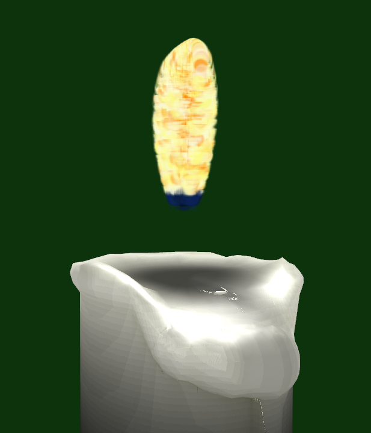

Ce projet est pour un devoir du cours d'animation 3D en équipe de deux. Le choix était libre. Nous avons choisi de fabriquer une chandelle et de l’illuminer selon le phénomène de transillumination. Les tutoriaux 14, 15 et 16 de http://www.opengl-tutorial.org ont été utilisés et combinés dans le projet final. Il y a plusieurs artéfactes, mais nous sommes contents du résultat pour seulement quelques jours de travail.

**Utilisation**
--------------------------
Lancer l'éxécutable chandelle .exe fournit. Pour compiler et modifier le projet, télécharger les tutoriaux de http://www.opengl-tutorial.org et suivre les instructions du site pour le compiler. Ensuite, simplement copier-coller les fichiers du zip vers le dossier correspondant au tutoriel 14 : "TP4\ogl-master\tutorial14_render_to_texture", compiler le projet et lancer l’exécutable. Pour se déplacer dans la scène, on peut utiliser les flèches. La souris permet d’orienter la direction de la caméra.

**Fabrication de la chandelle**
----------------------------------
La chandelle a été fabriquée avec le logiciel Blender en plus d’un "bake" de la luminosité dans la texture ("ambiant occlusion"). Cette chandelle a été importée dans le tutoriel 15 sous le format ".obj". D’ailleurs, importer cet objet se fait assez aisément dans chacun des TP qui traitent de formes ".obj" avec leur texture respective. Il ne restait qu’à faire un changement de couleur sur la texture de "ambiant occlusion".

**Illumination de la chandelle**
--------------------------------------
Le tutoriel 14 a été utilisé pour calculer plusieurs couches de textures de profondeurs. Le but est de pouvoir calculer rapidement l’épaisseur de la chandelle par rapport à la caméra et par rapport à la lumière émise par la bougie. Les valeurs sont utilisées pour changer la perception de la lumière qui traverse le corps de la bougie.

Le calcul des différentes couches de profondeur a été fait de la façon suivante. Un shader enregistre la profondeur (gl_FragCoord.z) dans une texture. Il ne restait qu’à comprendre le principe de projection vers la lumière par la vue de la caméra pour comparer la profondeur de chaque pixel par rapport à la surface. C’est en regardant le tutoriel 16 (shadow_maps) qu’une astuce aidante a été trouvée. Il s’agit d’envoyer au shader de l’objet la matrice de transformation pour la projection vers la lumière. Ainsi, il est possible de retrouver les coordonnées sur les textures prises sur ces points de vue et de les utiliser. Il y a des artéfacts à cause de cette technique qui n’ont pas été réglés, puisqu’il est difficile de débugger son shader.

**Flamme**
---------------------------------------

Pour créer la flamme de la chandelle, le tutoriel 18 sur le thème des particules a été modifié. Voici les modifications apportées:

–	La durée de vie des particules a été diminuée à une seconde au lieu de la durée initiale de cinq secondes pour qu’elles disparaissent avant de redescendre. L’effet de la gravité a été gardé. Elle n’est pas nécessaire, mais intéressante puisque les particules des flammes sont nécessairement soumises à la gravité.
–	Le nombre de particules maximal est dix fois plus petit qu’initialement, puisqu’autant de particules étaient inutiles.
–	Au départ, les particules étaient lancées à partir d’un point fixe. Pour que la forme de la flamme soit réaliste, les particules sont maintenant lancées à partir d’un cercle. La moitié des particules sont lancées de manière aléatoire à partir de l’alentours du cercle et l’autre moitié à partir d’un point aléatoire à l’intérieur du cercle. Cette façon de faire est la plus efficace trouvée par essais erreurs pour que la flamme semble pleine alors qu’elle est composée de particules.
–	La grosseur des particules a été augmentée pour que la flamme paraisse plus pleine. Les particules sont aussi de grosseurs variables, mais moins variables qu’initialement. Au dernier 20% de la flamme, les particules rapetissent pour faire une belle fin de flamme.
–	La couleur des particules commence initialement bleue ,puis change pour un jaune presque blanc ou un orange pâle. Plus la particule est lancée à partir du centre du cercle, plus grande sont ses probabilités qu’elle soit orange pâle. Il y a aussi une légère variance aléatoire dans les couleurs, pour faire plus réel.
–	Initialement, les particules étaient lancées en ligne droite. Cela faisait que la flamme était de forme conique, ce qui n’est pas réaliste. Pour que la forme soit plus réaliste, la trajectoire des particules a été modifiée pour être courbée. Plus une particule s’éloigne du centre de la flamme, plus sa trajectoire sera courbée. Pour y arriver, les informations suivantes ont été ajoutées à la classe particule: pourcentage du trajet d’effectué (u), tangente du point de lancement de la particule, tangente de la pointe de la flamme et position de départ. Les tangentes et la position de départ sont inutilisées lors de la création d’une particule et le pourcentage du trajet d’effectué (u) est mis à jour lors des déplacements de particules. Avec ces informations, les particules sont déplacées selon le temps passé grâce à une courbe d’Hermite.
–	Ajouter du vent simple. Le vent souffle dans une direction aléatoire pour 0,1 seconde, puis souffle dans une autre direction. Le vent est représenté simplement par une translation.

En plus de me familiariser avec OpenGl, la création de la flamme m’a appris le fonctionnement de base des particules. Il m’a appris aussi à comment créer un effet désiré sans savoir comment y arriver au départ. J’ai dû plusieurs fois visualiser à quoi ressemblait ma flamme, pour voir ses défauts, puis analyser comment je pourrais l’améliorer. Par essais erreurs, l’effet finit par être de plus celle souhaitée.

